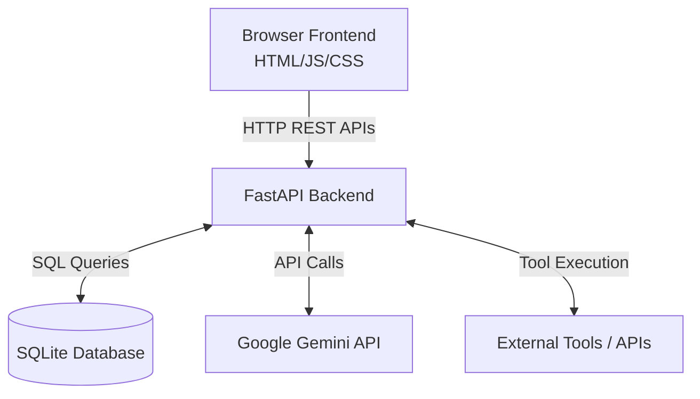

# 系統架構設計 (ARCHITECTURE)

## 技術選型
本專案採用前後端分離的架構設計。
- **前端**：HTML, Vanilla JavaScript, CSS (Tailwind CSS via CDN)。負責使用者介面呈現與互動。
- **後端**：Python FastAPI。提供 RESTful API，處理商業邏輯與資料存取。
- **資料庫**：SQLite。輕量級關聯式資料庫，用於儲存使用者、Session、訊息與記憶。
- **AI 整合**：Google Gemini API (`google-generativeai`)。作為核心的大語言模型。

## 系統架構圖

## 主要 API Endpoints

| 路由 (Endpoint) | HTTP 方法 | 說明 |
| --- | --- | --- |
| `/api/sessions` | GET | 取得所有 Session 列表 |
| `/api/sessions` | POST | 建立新的 Session |
| `/api/sessions/{session_id}` | DELETE | 刪除指定的 Session |
| `/api/sessions/{session_id}/messages` | GET | 取得指定 Session 的所有訊息歷史 |
| `/api/chat` | POST | 傳送訊息給 AI，並串流或直接回傳回應 (包含處理 Tool Calling) |
| `/api/upload` | POST | 上傳檔案 (圖片/文件)，回傳檔案的暫存路徑或 URI |
| `/api/memory` | GET | 取得當前使用者的偏好記憶 |
