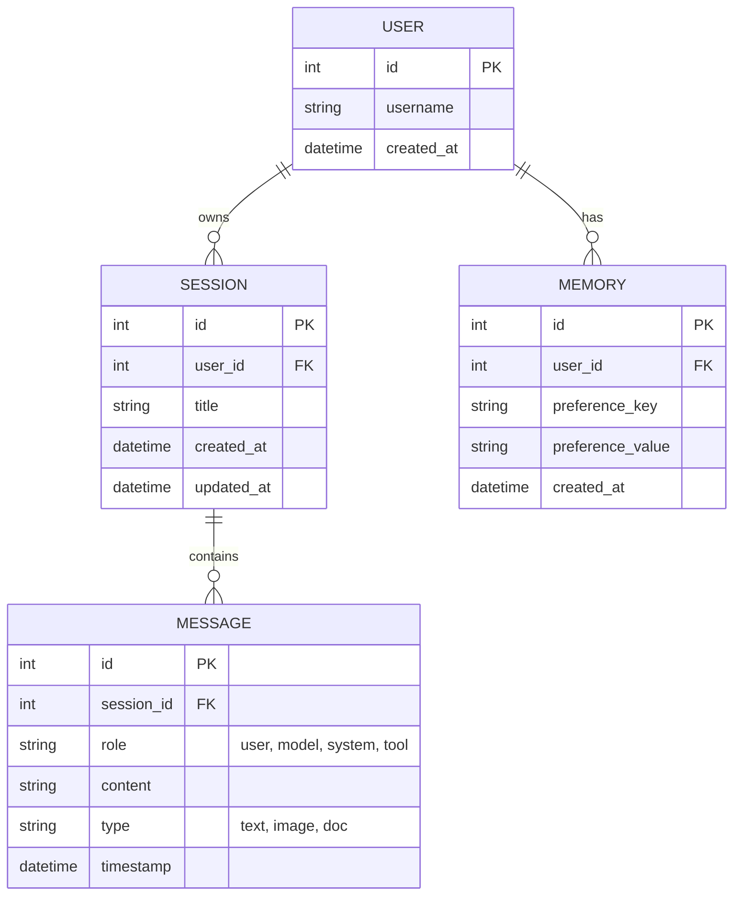

# 資料庫 Schema (MODELS)

本專案使用 SQLite 作為關聯式資料庫，以儲存對話狀態與記憶。

## 資料表關聯圖 (ER Diagram)

## Schema 說明

### 1. User
*(簡單實作可省略，預設為單一本地使用者)*
- `id`: Primary Key
- `username`: 使用者名稱
- `created_at`: 建立時間

### 2. Session
用於管理多個對話工作階段。
- `id`: Primary Key
- `user_id`: 關聯的使用者
- `title`: 依據第一則訊息自動產生的標題
- `created_at`: 建立時間
- `updated_at`: 最後更新時間

### 3. Message
儲存所有的對話紀錄。
- `id`: Primary Key
- `session_id`: 所屬的 Session
- `role`: 發送者角色 (通常為 `user` 或 `model`)
- `content`: 訊息內容 (文字或檔案路徑/URI)
- `type`: 訊息類型 (`text`, `image` 等)
- `timestamp`: 發送時間戳記

### 4. Memory
儲存跨 Session 的使用者偏好與記憶。
- `id`: Primary Key
- `user_id`: 關聯的使用者
- `preference_key`: 記憶的鍵值 (例如: `user_name`, `dietary_preference`)
- `preference_value`: 記憶的內容
- `created_at`: 建立時間
